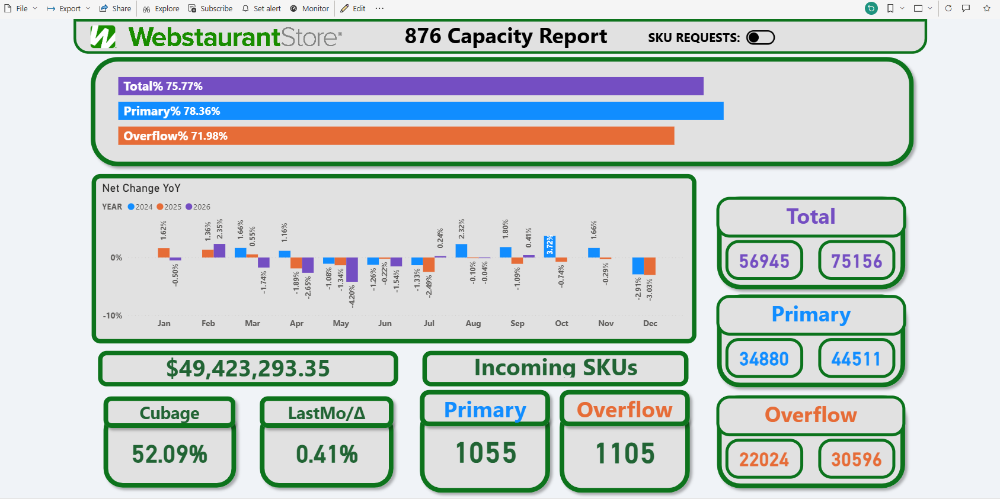
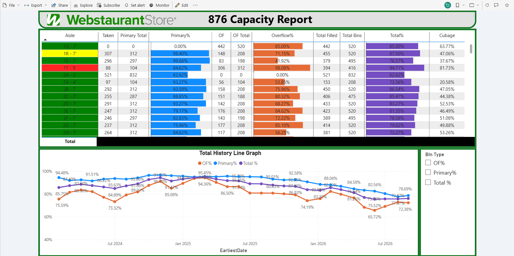
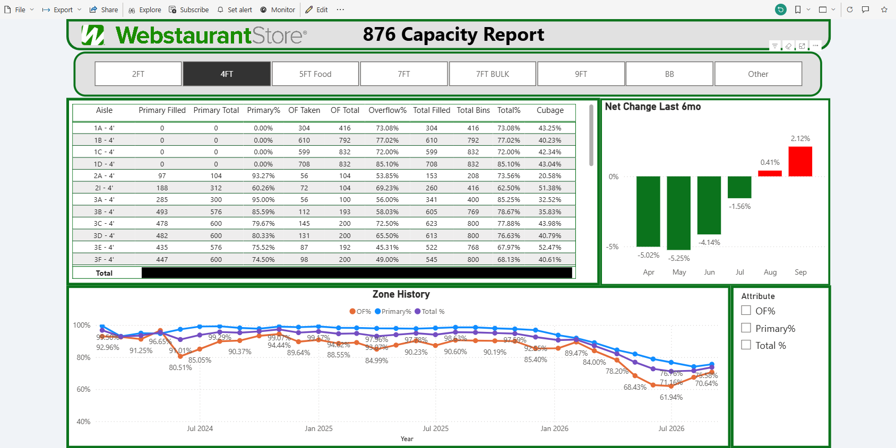
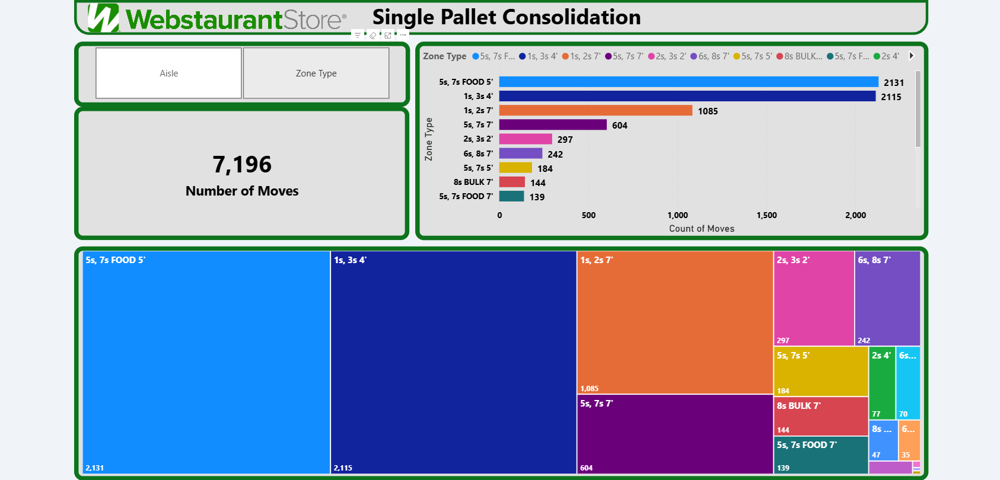
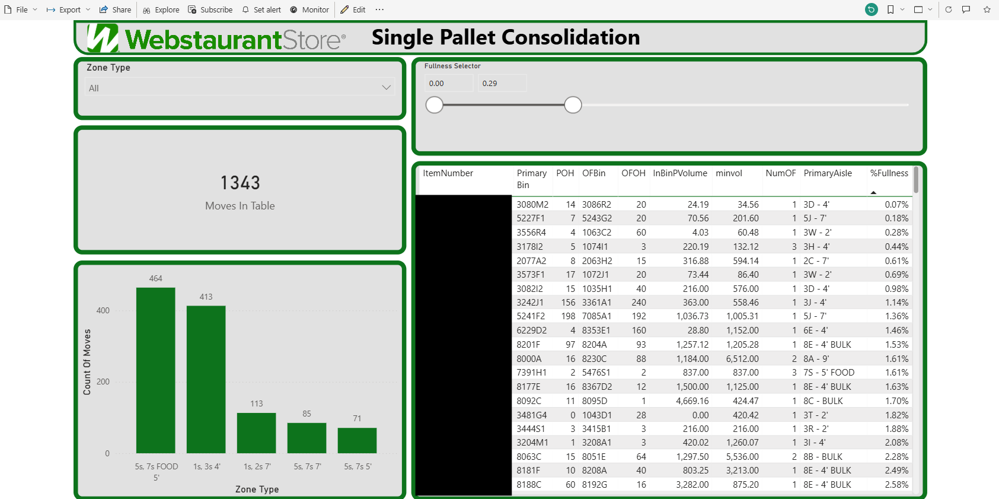
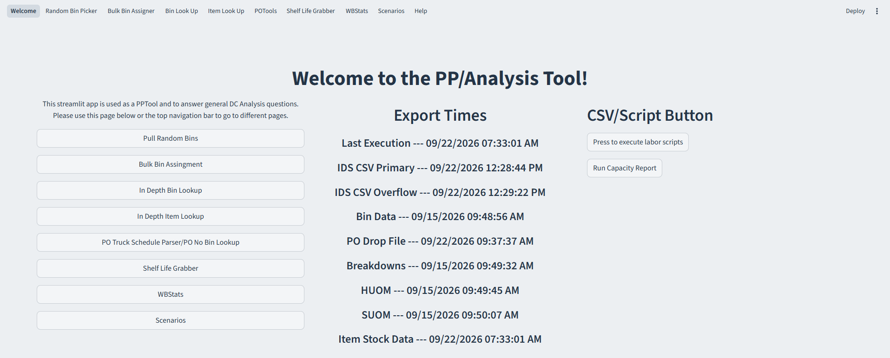
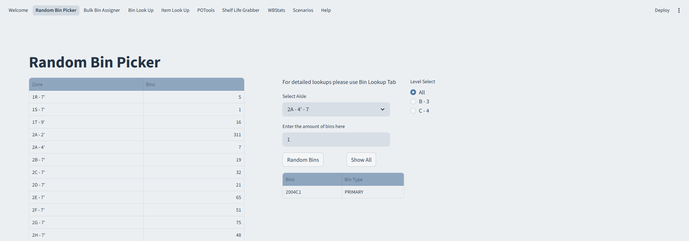
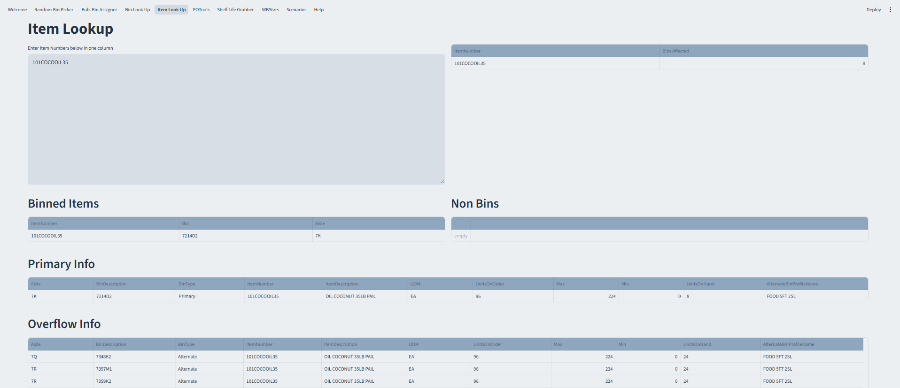

## About Me
[Email](mailto:berkeyjonathan3@gmail.com "Email")
[LinkedIn](https://www.linkedin.com/in/jonathan-berkey-4806a119b/ "LinkedIn")

Inventory/Capacity Specialist with experience applying data extraction, transformation, and loading (ETL) techniques to support operational analysis and improvement. I want to focus on continuing to develop my skills in data analytics to drive actionable business decisions. Feel free to reach out for any additional information.  

- 📦 Product Placement for WebstaurantStore Distribution Center (Buckhorn, PA)
- 🎓 Bachelor's Degree (Indiana University of Pennsylvania) Communication Media
- 🖥️ Loves data ETL/manipulation
- 🚲 Loves riding MTB
- 🕹️ Gaming and watching movies on weekends  

## Data ETL Tools

## Python Libraries

# Projects
Reach out via email for any requests regarding access to any repos or projects. Some sensitive information is omitted from these screenshots.
## Power BI
### Capacity Tool
Power BI tool used to analyze warehouse capacity by zone and identify capacity constraints. Built using Power Query for ETL, DAX for capacity measures, and interactive drill-through views for in-depth analysis.

### SinglePalletConsolidationVis
Power BI tool used to visualize bins within the DC with the same items that can be consolidated together to free up space. Built using Power Query and DAX for interactive filtering by zones or items.

## Python
### Streamlit Capacity Tool
Streamlit app used for data analysis built with Python and pandas for generating reports, and binning new items entering the DC.

### Data Class and Labor Scripts
A class was made using Python and the pandas package to manipulate and analyze CSVs. Some projects that were made using this class are described below. Modules are available upon request.

- Data Class - Used to complement other scripts by pulling data and using properties and methods to manipulate data.

- Single Pallet Consolidation - Script manipulates CSVs to find bins with items that can be consolidated together using item and bin volume.

- Wrong Zone - Used to find items that have overflow on the wrong side of the DC. Using this script and combining these bins reduces travel time for drivers when replenishing the main bin for the item.

- Replen Count Tool - Takes a roster and CSVs to aggregate the number of moves or amount of labor completed by each employee.
